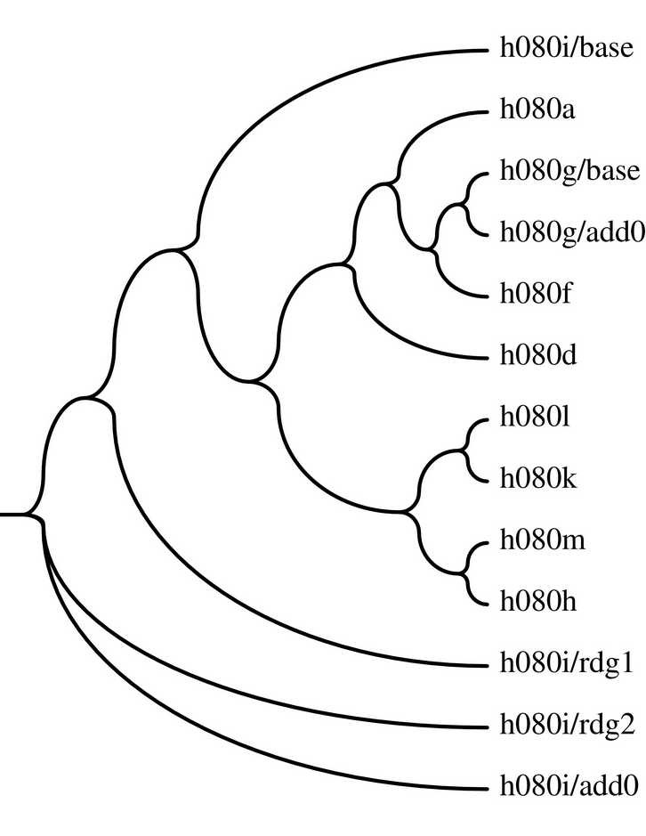

## Tree

This is a service that renders an MVD as a phylogentic cladogram or 
similar. It is based on Phylip's drawgram tool. There are several 
options recognised by the service. Not all drawgram options are 
configurable.

The service runs on port 8091 in debug mode and in Tomcat on 8080.

### Parameters
docid -- required. This denotes the MVD in the cortex collection that
will be used to generate the cladogram.

font -- may be one of many fonts listed in the Phylip documentation. The 
main ones are Times-Roman, Helvetica, Palatino-Roman, Courier.

treegrows -- horizonal or vertical

treestyle -- one of phenogram (angular branches), cladogram (square 
branches), curvogram (curved branches), eurogram (straight then 
angular), swoopogram (curved at each end otherwise straight), circular 
(displays a circular tree with straight or circular branches).

usebranchlengths -- true or false. This adjusts branch lengths based on 
edit distance. Not very useful unless all versions are substantially 
different. Closely related versions tend to collide.
 
ancnodes -- controls how branches are anchored to their parents. May be: 
weighted, centered, inner or vshaped (crashes). Inner is interesting but 
weighted is probably more useful.

### Requirements
Tree needs libgs. I installed libgs-dev on Ubuntu. Also needs the 
libdrawgram.so library installed in /usr/lib. This can be had from the 
Phylip package. You have to build it first:

    unzip phylip-3.696.zip
    cd phylip-3.696/src
    make -f Makefile.unx all
    sudo mv libdrawgram.so /usr/lib

Also assumed is that there is a Mongo database called calliope 
containing a collection "cortex" with MVDs in it. This is because this 
service is intended to run as part of the Ecdosis back end.

### Example of Charles Harpur's Creek of the Four Graves in the "swoopogram" style:

